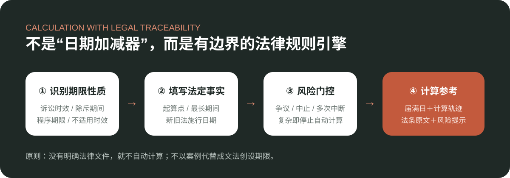

<div align="center">
  

  # 权衡 · 法律期限助手

  **先识别期限性质，再计算日期。每一步计算，都能回到现行法条。**

  [在线使用](https://quanheng-deadline.wudongbird.chatgpt.site/) · [查看规则台账](docs/LEGAL-SOURCES.md)

     
</div>

## 为什么做这个产品

法律期限并不是简单的“三年减法题”。民事案件可能涉及普通或特别诉讼时效、仲裁时效、除斥期间和程序期限；刑事案件要依具体罪名的法定最高刑判断追诉期限；行政争议还要区分直接起诉、复议后起诉、复议申请期限和最长起诉期限。起算点、中止、中断、期限扣除、新旧法衔接和最长期间都会改变结果。

权衡把现行法律文件拆成可追溯规则，先帮助用户识别期限性质，再在法定事实明确时计算参考日期。事实复杂时，系统停止自动计算并明确提示人工核对。刑事部分使用“追诉期限”、行政部分使用“起诉期限／复议申请期限”，不把不同制度笼统称为诉讼时效。



## Windows 网页版

本仓库只公开 Windows 浏览器使用的网页版。推荐使用最新版 Microsoft Edge 或 Chrome 打开，具备完整规则库、普通/专业模式、计算轨迹、法源链接与打印功能；页面同时支持常见桌面分辨率自适应。

## 项目亮点

- **规则可追溯**：每项可计算参数都关联现行法律文件、具体条文与官方来源。
- **判断与计算分离**：先识别期限性质，再进入日期计算，减少把不同法律期间混为一谈的风险。
- **双层交互**：普通模式降低使用门槛，专业模式保留计算轨迹与法源核验入口。
- **复杂情形止损**：遇到事实争议、多次中断或复杂送达等情形时，不给出伪精确日期，转为人工核对提示。

## 技术实现

项目使用 React、TypeScript 与 Next.js 兼容路由开发。法律规则与页面组件分离，日期计算由本地规则引擎完成，不需要提交姓名、身份证号、案号或完整案情。仓库包含自动化测试、类型检查、代码规范检查和生产构建流程。

## 已覆盖的规则

| 分类 | 数量 | 示例 |
|---|---:|---|
| 普通诉讼时效 | 11 | 一般三年、分期债务、特殊起算、中止、中断、二十年期间 |
| 特别诉讼时效 | 22 | 产品、保险、知识产权、生态环境、航空、海商 |
| 仲裁时效 | 4 | 劳动、劳动报酬、农村土地、撤销仲裁裁决 |
| 除斥与权利行使期 | 25 | 撤销权、解除权、公司决议、票据、优先购买权、遗赠 |
| 担保与优先权 | 3 | 保证期间、抵押权、建设工程价款优先权 |
| 诉讼与执行期限 | 6 | 上诉与候选生效日、再审、第三人撤销、申请执行 |
| 不适用诉讼时效 | 4 | 停止侵害、特定返还财产、抚养赡养、特定金融请求 |
| 刑事追诉期限 | 8 | 四档法定最高刑、连续或继续犯罪、再犯罪、刑法第八十八条例外 |
| 行政起诉期限 | 12 | 直接起诉、复议后起诉、不履职、期限扣除、行政上诉 |
| 行政复议申请期限 | 5 | 六十日、未告知、一年节点、五年／二十年上限 |

规则均关联具体条文、官方原文、效力状态和核验日期。完整目录见 [法律规则与法源](docs/LEGAL-SOURCES.md)。

## 产品原则

- 不自行编写法律期限；自动计算参数必须来自现行法律或司法解释。
- 案例只用于验证边界，不以个案替代成文法创设规则。
- 中止、多次中断、连续或继续犯罪、逃避侦查、期限扣除、复议前置、复杂送达、最长期间延长或事实争议自动转为人工判断。
- 只输出“计算参考＋风险提示”，不输出“确定法律结论”。
- 不需要姓名、身份证号、案号或完整案情。

## 本地运行网页版

```bash
npm install
npm run dev
```

质量检查：

```bash
npm test
npm run typecheck
npm run lint
npm run build
```

## 项目维护

项目负责人：[小林绿子（@Dekkon717）](https://github.com/Dekkon717)

欢迎通过 [Issues](https://github.com/Dekkon717/quanheng-deadline/issues) 提交功能建议、计算边界问题或已公开的法源更新线索。请勿上传真实案件材料或个人敏感信息。

## 重要声明

本项目是法律期限辅助工具，不构成法律意见，不替代律师，也不替代人民法院、检察机关、公安机关、行政复议机关、仲裁机构或其他有权机关对事实、证据和法律适用的判断。法定节假日顺延、送达时间和程序状态应在实际办事前再次核对。

法源核验截至：**2026-08-28**。
